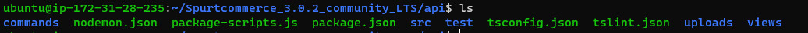
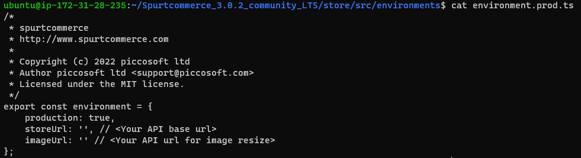
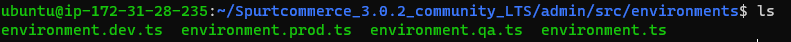

## Node Js Installation

* You can use the following commands to install the required version of NodeJS in your system.

```
curl -sL https://deb.nodesource.com/setup_14.x | sudo -E bash 
sudo apt-get install -y nodej
sudo apt-get install -y build-essential
sudo npm install forever -g
sudo npm install apidoc -g
```

## Apache Installation

```
sudo apt install apache2
sudo a2enmod proxy
sudo a2enmod proxy_http
sudo a2enmod headers
sudo systemctl restart apache2
```

## Mysql Installation

```
sudo apt-get install mysql-server -y
sudo mysql -u root
mysql > SELECT User, Host, plugin FROM mysql.user;
mysql > ALTER USER 'root'@'localhost' IDENTIFIED WITH mysql_native_password BY 'Password';
mysql> FLUSH PRIVILEGES;
mysql> CREATE DATABASE <Database_Name>;
mysql> Exit;
```

## Imagemagick Installation

```
sudo apt install imagemagick
```

## Angular Installation

```
sudo npm install -g @angular/cli
```


## Back End API Setup

* Download Spurt Commerce `sudo git clone https://github.com/spurtcommerce/spurtcommerce.git`

```
cd spurtcommerce
sudo chown -R $USER:$USER spurtcommerce/
cd spurtcommerce/api
```
* In `package.json` change bcrypt to `5.0.1` 

* Change apache configuration
 
```
cd /etc/apache2/sites-available/
sudo nano 000-default.conf
```
* Add This Code
```
ProxyRequests off

<Proxy *>

    Order deny,allow

    Allow from all

</Proxy>

<Location /backend>

    ProxyPass http://127.0.0.1:8000 
    ProxyPassReverse http://127.0.0.1:8000

</Location>

```

* Create new database and import your sql file and set your root, database name and password in `.env.production` and `.env` file

```
npm install
npm install typeorm-seeding@1.0.0-beta.6 -- save
```

*  In STORE_FORGET_PASSWORD_URL , you have to give the store forgotten password reset url path (e.g:”https://<STOREURL>/setPassword/”).

* In FORGET_PASSWORD_URL , you have to give vendor forget password reset path url path (e.g:”https://<VENDORURL>/#/auth/set-password/”).

```
npm run build
```
```
cd spurtcommerce/
sudo mysql -u root -p database_name <  spurtcommerce.sql
```
```
NODE_ENV=production node dist/app.js
sudo NODE_ENV=production forever start dist/app.js
```

* After api running successfully, open browser and give http://ip address/backend/apidoc/ will be able to see apidoc, which implies you that api installed in server.

* After running the above steps, you have successfully setup the API server. You can now open the browser and give this URL — http://<YOUR_IP_ADDRESS>/backend/apidoc and check the API Documentation.

## Front End Setup
### Store Setup

* Upload **store** folder into the server root ( Like /home/ubuntu/ )

* You need to open the file 
```
sudo vi spurtcommerce/store/src/environments/environment.ts
sudo vi spurtcommerce/store/src/environments/environment.prod.ts
```
and then change the below URLs.



```
export const environment = {

    production: true,
    storeUrl: 'http://localhost/backend/api/',
    imageUrl: 'http://localhost/backend/api/media/image-resize'

};

```



* In order to run the store, you need to install dependency libraries.

* `npm install` — By using this command, you will be installing the dependency libraries.

* After installation of dependency libraries, you have to now build the Spurtcommerce Store application, using this command —  `ng build --prod`

* Once the build is successful, you will see a folder called dist. The files within that folder has to be moved to the server apache path — Path — `/var/www/html`

* After all the above steps are completed, you can open the browser and give the URL — http://<YOUR_IP_ADDRESS>. You will be able to check the store. 

### Admin Setup

* Upload **admin** folder into the server root ( Like /home/ubuntu/ )

* You need to open the file — `sudo vi spurtcommerce/admin/src/environments/environment.prod.ts` and then change the below URLs.



```
export const environment = {

    production: true,
    baseUrl: 'http://localhost/backend/api',
    imageUrl: 'http://localhost/backend/api/media/image-resize',
    productUrl: 'http://localhost/',
    pluginUrl: 'http://localhost/backend/'

};

```

* In order to run the store, you need to install dependency libraries.

* `npm install` — By using this command, you will be installing the dependency libraries.

* After installation of dependency libraries, you have to now build the Spurtcommerce admin application, using this command — `ng build –prod`

* Once the build is successful, you will see a folder called dist. The files within that folder has to be moved to the server apache path — Path — `/var/www/html/admin`

* After all the above steps are completed, you can open the browser and give the URL — http://<YOUR_IP_ADDRESS>/admin. You will be able to check the admin.

* In order to login to the admin, the default login credential are given below:
```
username : admin@spurtcart.com
password : spurt123@
```